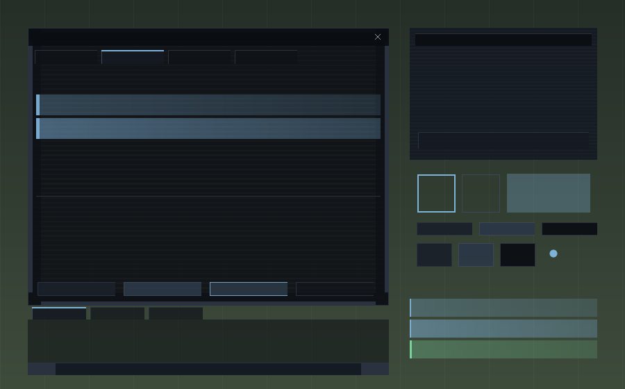

# MithrilUI

A minimal, clean interface overhaul for **The Lord of the Rings Online** — flat
panels, one hairline border, one accent colour. No wood grain, no gold filigree,
no parchment, no glass gloss.

Pure skin: it repaints and declutters the game's own interface and nothing else.
No Lua plugins, no extra windows, no runtime code. Every asset is generated from
a theme file, so a whole retheme is one JSON edit and a rebuild.



*Mock-up composited from the actual generated TGA files. `mithril-ash` is the
same geometry with a different palette — [see it here](docs/preview-ash.png).*

---

## Is this allowed in 2026?

Yes. Skinning is built into the client by Standing Stone Games and switched on
from the game's own options panel. The community archive at
[lotrointerface.com](https://www.lotrointerface.com/downloads/) is actively
updated, with skin uploads through 2026.

A skin is XML plus images. It replaces named art assets and repositions named
interface elements — that is the entire vocabulary. It cannot read game state,
cannot run code, and cannot do anything at all beyond changing which pixels get
drawn. **[docs/SAFETY.md](docs/SAFETY.md)** has the detail.

## Honest scope: what ElvUI does that this cannot

Worth knowing before you install, because the difference is architectural rather
than a matter of effort. WoW's UI is written in Lua, so ElvUI can rebuild it.
LOTRO's UI is native C++ and only its *artwork and element geometry* are
exposed to skins.

**Not possible for any LOTRO skin:**

- Rebuilding unit frames, action bars or nameplates as new widgets
- Adding behaviour: no drag-to-resize, no new buttons, no scripting
- Anything conditional — a skin has no logic, only a fixed mapping

**What you get instead:** every ornate frame, carved plate, gold filigree and
glass overlay in the interface replaced with flat colour or removed outright,
while the layout stays exactly where the game's own UI-layout tool (Ctrl+\)
put it.

## Quick start

Python 3.9+, nothing else to install.

```bash
git clone https://github.com/Felix-Helleckes/MithrilUI.git
cd MithrilUI
python tools/build.py
python tools/install.py
```

Restart the client — skins are only read at startup — then **Options (Ctrl+O) →
UI Settings → Misc → Current User Skin → MithrilUI Dark**.

Prefer not to build? Grab the archive from
[Releases](https://github.com/Felix-Helleckes/MithrilUI/releases) and unzip it
straight into `ui\skins\`.

Full walkthrough and troubleshooting in [docs/INSTALL.md](docs/INSTALL.md).

## What is in it

**~1800 replaced assets.** 139 are hand-tuned against the documented ArtAssetID
dictionary — panel bodies, 9-slice frames, title bars, buttons, tabs, chat,
list selections. The rest come from the **sweep**: an ordered set of name
patterns over a 2795-entry asset list mined from two shipping skins, because
the official dictionary dates from 2007 and covers barely 5% of what the
modern client draws.

The sweep's governing rule is that removing ornament means making it invisible,
not painting a dark rectangle over it — a dark fill on an unknown asset covers
whatever the client draws underneath:

| Group | Treatment |
|---|---|
| HUD ornament (the carved plates around vitals) | cleared |
| Toolbar plate, its end caps, its glass sheen | dark, bottom 80% only |
| Window bodies, backdrops | 72% flat fill |
| Buttons, slots, tabs | 55% translucent plate |
| Hover / pressed / selection | light accent wash |
| XP bar fills | flat accent, green for rested, dim for suppressed |
| Icons, class resources, quest difficulty, item rarity, checkboxes, scrollbars, loading bars, the map marker | **never touched** (866 assets) |
| Everything else — frames, corners, caps, filigree | cleared |

That last "never touched" row grew from 597 to 866 during testing, one report
at a time: the loading bar, the toolbar buttons, the map arrow and a Warden's
gambit symbols all looked like ornament by name and were not. A name-based
rule cannot tell decoration from mechanics, so anything it cannot positively
identify is left alone.

**Bonus: an alignment grid that appears only in the UI layout editor.** The
client draws `hidden_dragbar_normal` over movable panels while the editor is
open and nowhere else, so mapping it gives a "show only in layout mode"
overlay with no logic involved — which is just as well, since neither a skin
nor a plugin can detect that mode.

## Tools

The point of the tooling is that nothing is hand-drawn or hand-edited. A theme is
one JSON file that drives every asset in the skin.

| Command | Purpose |
|---|---|
| `tools/build.py` | Themes + recipes + layout → a ready skin folder |
| `tools/preview.py` | PNG mock-up or contact sheet from the real TGAs, no game restart |
| `tools/validate.py` | Catches the silent failures: bad XML, missing files, wrong sizes, unresolved templates |
| `tools/extract_ids.py` | Mines panel/element IDs out of any installed skin — the only practical way to find them |
| `tools/install.py` | Copies or symlinks into the LOTRO folder; `--uninstall`, `--dry-run` |
| `tools/package.py` | Release zips in the single-root-folder shape lotrointerface.com requires |
| `tools/debug_lookup.py` | Turns a colour picked out of a screenshot back into the ArtAssetID that drew it |

```bash
python tools/build.py --resolution auto
python tools/build.py --theme mithril-ash
python tools/build.py --profile ident
python tools/preview.py --sheet
```

`--resolution auto` reads the value out of LOTRO's own `UserPreferences.ini`,
because building a layout for the wrong resolution is the easiest mistake to
make and the answer is already on disk.

## Making it yours

Copy a file in `themes/`, change the hex values, `python tools/build.py --theme
<your-id>`. That is the whole workflow — every asset is drawn from a recipe
(`solid`, `panel`, `nine_corner`, `button`, `tab`, `selection`, `ring`, …), so a
new palette is a rebuild, not a redraw.

Adding an asset means one entry in `skin/assets.json` with the size from the
[official ArtAssetID dictionary](https://www.lotrointerface.com/index.php?p=ui_skinning_2).
Adding a look means one function in `tools/gen_art.py`.

## Diagnosing a skin

Most ArtAssetIDs say nothing about where they appear — the world map's player
arrow is called `note_avatar` — and LOTRO reports a bad skin by silently
leaving it out of the list. So there is a diagnostic skin that paints every
asset it controls in its own colour, and a scanner that reads a screenshot
back:

```bash
python tools/build.py --profile ident && python tools/install.py --skins-only
```

Pick **MithrilUI Dark (Ident)** in game, screenshot the area in question, then:

```bash
python tools/scan_screenshot.py shot.jpg --bottom 240
```

That names every asset in the frame with its pixel count and bounding box, so
one screenshot answers a whole region instead of one element. Matching is
nearest-neighbour with a tolerance, since LOTRO writes JPEGs.

Anything that keeps its original look under `ident` is drawn by the client and
cannot be reached from a skin at all — which is itself the answer to a whole
class of question, including the minimap's gold rim.

## Status

**v1.0.0 — played on, not just built.**

Every asset generates, all builds pass the validator, and the generated XML
parses. More to the point, this was used through a levelling run and fixed
against what actually broke rather than against a checklist.

**Read this before installing.** About 280 assets are cleared by a catch-all
rule because no named rule recognises them, and their names give no clue what
they draw. Every regression this project has had came from that rule, and each
one was found by a player noticing something missing, not by testing:

| Found | Was actually |
|---|---|
| Black blocks over the portrait | An opaque fill on an unknown asset |
| Toolbar buttons gone | `bag1_normal` *is* the button, not a frame around it |
| Loading bar broken | `progress_overlay_*` |
| Map arrow missing | `note_avatar` |
| Warden gambit symbols gone | `gambit_orangestar` and friends |

All of those are fixed and excluded. The point is that the list was found this
way, so **if something disappears that you need, please report it** — the fix
is one line, and the asset almost certainly has a name nobody would guess.

Verified on a Warden at 2560×1440. Class-specific displays for Champion,
Brawler, Weaver and Rune-Keeper are protected by rule and look correct in the
manifest, but have not been seen in game.

Known gaps:

- The minimap cannot be skinned at all — no panel, element or art ID for it
  exists in any of the ~4500 identifiers mined from two shipping skins
- Toolbar button alignment needs geometry measured against the *stock* toolbar;
  the module ships disabled because the only numbers available describe another
  skin's redesign, and applying them was worse than stock
- Fonts cannot be changed by any means: no font asset, no font file on disk, no
  config key. Size only, via the game's own options

## Credits

Built on the community's documentation, not on its art — every pixel here is
generated. Thanks to the authors keeping LOTRO skinning alive, in particular
[Adra's JRR Skins Collection](https://www.lotrointerface.com/downloads/info581-jrrskinscollection-atributetomiddleearth.html),
whose structure was the reference for how modern `PanelFile` layout actually
works, and to [LoTROInterface](https://www.lotrointerface.com) for hosting the
API and skinning documentation.

Not affiliated with or endorsed by Standing Stone Games or Middle-earth
Enterprises. *The Lord of the Rings Online* is a trademark of its respective
owners.

## Licence

[MIT](LICENSE).
